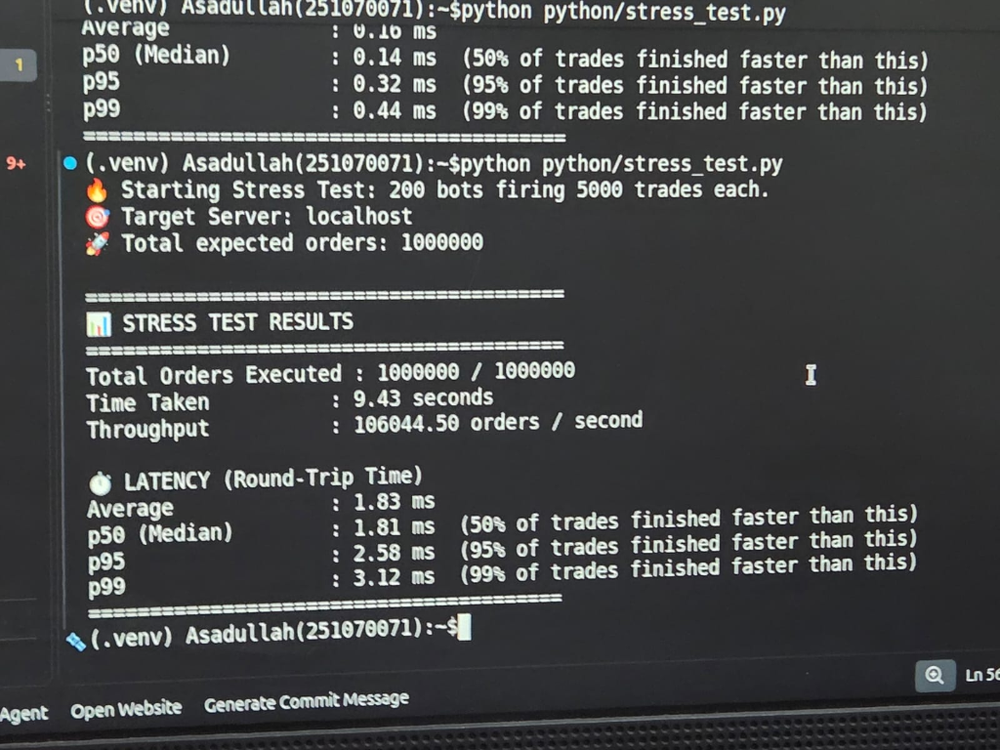
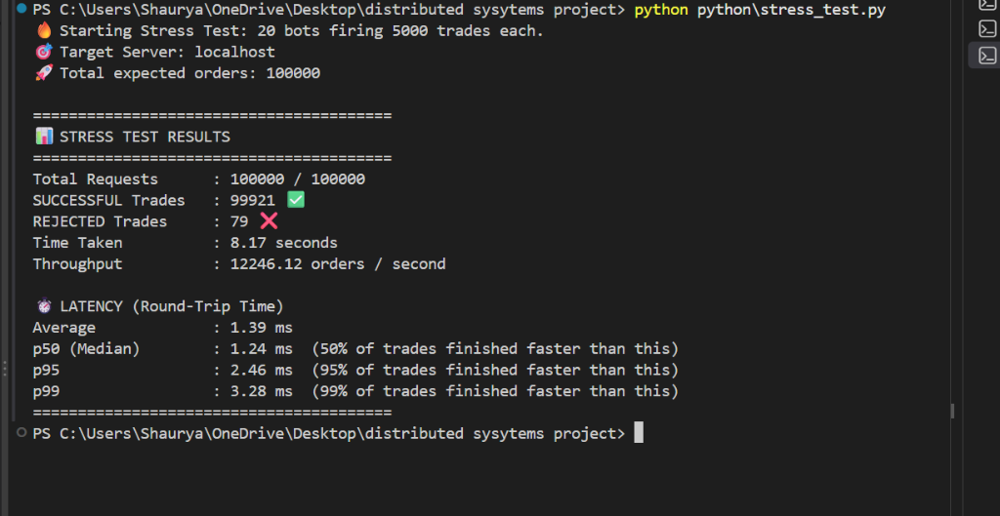
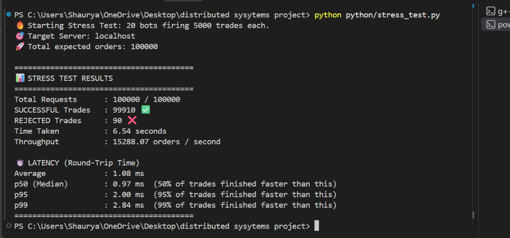
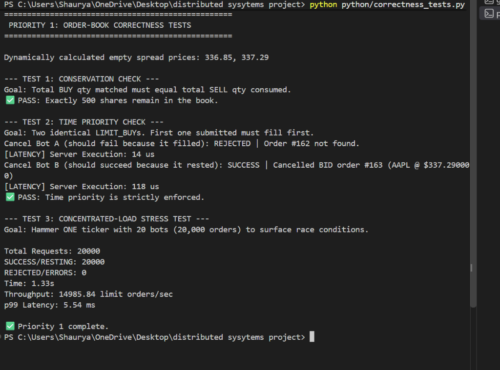

<p align="center">
  
  
  
  
  
</p>

<h1 align="center">TradeVerse</h1>

<p align="center">
  <strong>A high-performance, multithreaded market data & order execution engine</strong><br/>
  <sub>Built with C++17 | ZeroMQ | Write-Ahead Logging | Price-Time Priority Matching</sub>
</p>

<p align="center">
  <a href="#quick-start">Quick Start</a> &middot;
  <a href="#architecture">Architecture</a> &middot;
  <a href="#features">Features</a> &middot;
  <a href="#trade-commands">Commands</a> &middot;
  <a href="#performance--stress-testing">Performance</a> &middot;
  <a href="#authors">Authors</a>
</p>

---

## Overview

**TradeVerse** is a concurrent, multithreaded trading engine that simulates a real-world electronic exchange. It pairs a low-latency C++17 backend (order matching, WAL persistence, live price simulation) with Python client interfaces for trade execution and real-time market data streaming, all communicating over ZeroMQ sockets.

### Why TradeVerse?

| Challenge | TradeVerse's Approach |
|---|---|
| Order matching under concurrency | Per-ticker sharding with lock-free FIFO queues (zero cross-ticker contention) |
| Write latency at scale | Async WAL queue with background writer thread (disk I/O off the hot path) |
| Crash recovery | WAL replay on startup restores volume deltas for market trades |
| Realistic simulation | Per-ticker GBM price model with mean-reversion and configurable volatility |
| Client flexibility | ZeroMQ PUB/SUB for streaming, REQ/REP for trade execution |

---

## Quick Start

### Prerequisites

| Dependency | Purpose | Install |
|---|---|---|
| **g++** (MinGW/MSYS2) | C++17 compiler | `pacman -S mingw-w64-x86_64-gcc` |
| **libzmq** | ZeroMQ messaging | `pacman -S mingw-w64-x86_64-zeromq` |
| **Python 3.10+** | Client scripts | [python.org](https://www.python.org/) |
| **pyzmq** | Python ZeroMQ bindings | `pip install pyzmq` |
| **yfinance** | Market data fetcher | `pip install yfinance pandas numpy` |

### Option A: One-Command Launch

**Windows:**
```bash
cd TradeVerse
start.bat
```

**Linux / macOS:**
```bash
cd TradeVerse
chmod +x start.sh && ./start.sh
```

> The launcher automatically fetches fresh market data, compiles the server, and launches the engine.
> Falls back to cached CSV if the network fetch fails.

### Option B: Manual Steps

```bash
# 1. Fetch live market data from Yahoo Finance
python python/data.py

# 2. Build & launch the C++ server
cd cpp
g++ -std=c++17 -O2 -o server.exe server.cpp -lzmq -lws2_32 -lpthread
cd ..
cpp/server.exe

# 3. Connect clients (separate terminals)
python python/trade_client.py       # Interactive trade terminal (port 5556)
python python/client.py             # Live market data stream   (port 5555)
```

### Verify It's Working

Once the server prints `Server fully started. Ready to accept trades.`, open the trade terminal and run:

```
Trade Terminal > STATUS_CHECK
```

You should see ticker count, order book stats, and a `Server is HEALTHY` message.

---

## Architecture

```
                          +-------------------------------------------------+
                          |         C++ Server  (server.cpp)                 |
                          |                                                  |
                          |  +----------+    +----------+                    |
  Python Clients <--5556--+  |  ROUTER  |----+  DEALER  |---> 10 Worker     |
  (trade_client.py)       |  |(frontend)|    |(backend) |     Threads       |
                          |  +----------+    +----------+     BUY / SELL    |
                          |                                   LIMIT / CANCEL |
  Python Clients <--5555--+  PUB Broadcaster                                |
  (client.py)             |  (live market stream @ 1 Hz)                    |
                          |                                                  |
                          |  +-------------------------------------------+  |
                          |  |  Per-Ticker Order Queue Processors         |  |
                          |  |  - Independent shard per ticker            |  |
                          |  |  - Lock-free FIFO queue + single matcher  |  |
                          |  |  - Price-time priority ordering            |  |
                          |  |  - Result delivery via std::promise        |  |
                          |  +-------------------------------------------+  |
                          |                                                  |
                          |  +-------------------------------------------+  |
                          |  |  Per-Stock Order Books                     |  |
                          |  |  - Seeded with 8-level synthetic depth     |  |
                          |  |  - Bids: std::map (DESC)                  |  |
                          |  |  - Asks: std::map (ASC)                   |  |
                          |  +-------------------------------------------+  |
                          |                                                  |
                          |  +-------------------------------------------+  |
                          |  |  WAL Engine                                |  |
                          |  |  - Append-only trade journal               |  |
                          |  |  - Async background writer thread          |  |
                          |  |  - CSV flush every 5 seconds               |  |
                          |  |  - Crash recovery via replay               |  |
                          |  +-------------------------------------------+  |
                          |                                                  |
                          |  +-------------------------------------------+  |
                          |  |  Price Simulation Engine                   |  |
                          |  |  - GBM with mean-reversion                |  |
                          |  |  - Per-ticker volatility profiles          |  |
                          |  |  - 500ms tick interval                     |  |
                          |  +-------------------------------------------+  |
                          +-------------------------------------------------+
```

### Concurrency Model

The server runs **6+ concurrent subsystems**:

| Thread | Role | Details |
|---|---|---|
| **Main** | PUB broadcaster | Publishes all ticker prices every 1s on port `5555` |
| **Proxy** | ROUTER-DEALER proxy | Binds port `5556`, distributes requests across workers |
| **Workers (x10)** | Command handlers | Parse and execute client commands concurrently |
| **Per-Ticker Processors (x10)** | Order matching | One thread per ticker -- AAPL and TSLA process in parallel |
| **WAL Writer** | Async disk I/O | Drains an in-memory queue and writes WAL + history to disk |
| **Flush** | WAL to CSV sync | Writes dirty state to CSV every 5 seconds |
| **Simulator** | Price engine | Updates all ticker prices every 500ms using stochastic model |

> **Parallelism:** Both limit orders and market orders are fully parallel across tickers. Each ticker has its own shard with independent `book_lock` and `price_lock`, eliminating cross-ticker contention entirely.

---

## Features

### Order Matching Engine

- **Market orders** (`BUY` / `SELL`) -- execute immediately at current price with liquidity validation
- **Limit orders** (`LIMIT_BUY` / `LIMIT_SELL`) -- match against resting orders or rest in the book
- **Price-time priority** -- orders at the same price level are filled FIFO
- **Partial fills** -- large orders can be partially filled with remaining quantity resting
- **Order cancellation** -- cancel both market trades (reversal) and resting limit orders

### Per-Stock Order Books

- Each of the 10 tickers maintains an independent order book
- **Bids** stored in a `std::map` sorted descending (highest first)
- **Asks** stored in a `std::map` sorted ascending (lowest first)
- Seeded at startup with 8 synthetic levels on each side for immediate liquidity
- Spread, depth, and best bid/ask visible via `ORDERBOOK:<TICKER>` command

### Write-Ahead Log (WAL) with Async Queue

```
BEFORE (v1):  Trade -> Lock -> math -> open file -> write -> flush -> Unlock -> Reply  (~15ms)
AFTER  (v2):  Trade -> Lock -> math -> push to queue -> Unlock -> Reply  (~0.001ms)
                                       +-- Background WAL writer thread drains queue to disk
                                       +-- Separate flush thread syncs CSV every 5 seconds
```

- **Non-blocking** -- trade threads push a `WalEntry` struct to an in-memory queue and return immediately
- **Background writer** -- a dedicated `async_wal_writer_thread` drains the queue using a condition variable and writes to `logs/wal.log`
- **Async flush** -- a separate thread syncs state to `data/market_data1.csv` every 5s
- **Crash recovery** -- on restart, WAL replays volume deltas for market trades
- **Audit trail** -- permanent history logged to `logs/trade_history.log`

### Price Simulation Engine

Prices evolve using a **Geometric Brownian Motion** model with **mean-reversion**:

```
dP = P * (sigma * N(0,1) + lambda * (P_base - P) / P_base)
```

| Parameter | Description | Value |
|---|---|---|
| sigma | Per-ticker volatility | 0.08% -- 0.35% |
| lambda | Mean-reversion strength | 0.02 |
| Tick interval | Price update frequency | 500ms |
| Floor | Minimum price | 1% of base price |

### Network Layer (ZeroMQ)

| Port | Pattern | Purpose |
|---|---|---|
| `5555` | PUB/SUB | Real-time market data broadcast (1 Hz) |
| `5556` | ROUTER/DEALER | Request-reply trade execution (10 workers) |

---

## Tracked Tickers

| Ticker | Company | Exchange | Volatility |
|---|---|---|---|
| `AAPL` | Apple Inc. | NASDAQ | 0.12% |
| `TSLA` | Tesla Inc. | NASDAQ | 0.30% |
| `GOOGL` | Alphabet Inc. | NASDAQ | 0.14% |
| `AMZN` | Amazon.com Inc. | NASDAQ | 0.18% |
| `MSFT` | Microsoft Corp. | NASDAQ | 0.10% |
| `NVDA` | NVIDIA Corp. | NASDAQ | 0.35% |
| `TCS.NS` | Tata Consultancy | NSE | 0.10% |
| `RELIANCE.NS` | Reliance Industries | NSE | 0.15% |
| `HDFCBANK.NS` | HDFC Bank | NSE | 0.08% |
| `INFY.NS` | Infosys Ltd. | NSE | 0.09% |

---

## Trade Commands

### Market Orders

| Command | Format | Example | Description |
|---|---|---|---|
| **Buy** | `BUY:<TICKER>:<QTY>` | `BUY:AAPL:10` | Buy shares at market price (validated against ask-side liquidity) |
| **Sell** | `SELL:<TICKER>:<QTY>` | `SELL:TSLA:5` | Sell shares at market price (validated against bid-side liquidity) |
| **Cancel** | `CANCEL:<TRADE_ID>` | `CANCEL:3` | Reverse a previously executed market trade |

### Limit Orders

| Command | Format | Example | Description |
|---|---|---|---|
| **Limit Buy** | `LIMIT_BUY:<TICKER>:<QTY>:<PRICE>` | `LIMIT_BUY:AAPL:10:220.50` | Place a limit buy -- matches against asks or rests in book |
| **Limit Sell** | `LIMIT_SELL:<TICKER>:<QTY>:<PRICE>` | `LIMIT_SELL:NVDA:5:145.00` | Place a limit sell -- matches against bids or rests in book |
| **Cancel Order** | `CANCEL_ORDER:<ORDER_ID>` | `CANCEL_ORDER:7` | Cancel a resting limit order from the book |
| **View Book** | `ORDERBOOK:<TICKER>` | `ORDERBOOK:GOOGL` | Display bid/ask depth for a ticker |

### Query Commands

| Command | Example | Description |
|---|---|---|
| `FETCH:<TICKER>` | `FETCH:AAPL` | Get live price, volume, best bid/ask |
| `PORTFOLIO` | `PORTFOLIO` | View all tickers with price, volume, and book info |
| `HISTORY` | `HISTORY` | View the last 20 executed trades |
| `STATUS_CHECK` | `STATUS_CHECK` | Server health, ticker count, WAL status |

---

## Project Structure

```
TradeVerse/
|
+-- cpp/                            # C++ Server Engine
|   +-- server.cpp                  # Main entry point: startup, proxy, PUB loop
|   +-- market_state.hpp            # Global state, WAL, flush, price simulator
|   +-- orderbook.hpp               # Order book structures, matching engine, queue
|   +-- utils.hpp                   # Timestamp & string utilities
|   +-- Makefile                    # Build configuration (g++ / MinGW)
|
+-- python/                         # Python Client Suite
|   +-- trade_client.py             # Interactive trade terminal (REQ -> port 5556)
|   +-- client.py                   # Live market data subscriber (SUB <- port 5555)
|   +-- data.py                     # Yahoo Finance data fetcher (7d, 1m intervals)
|   +-- portfolio.py                # Portfolio tracker with SQLite persistence
|   +-- dashboard.py                # Real-time market dashboard
|   +-- bot_wars.py                 # Multi-bot trading simulation
|   +-- rl_bot.py                   # Reinforcement learning trading bot
|   +-- send_command.py             # Lightweight command sender
|   +-- generate_portfolio.py       # Random 10K-position portfolio generator
|
+-- tests/                          # Test Suite
|   +-- correctness_tests.py        # Order-book conservation, time priority, load
|   +-- correctness_tests2.py       # Extended correctness validation
|   +-- input_validation_test.py    # Edge cases: zero qty, negative qty, fake ticker
|   +-- multilevel_test.py          # Multi-level fill (walking the book)
|   +-- price_test.py               # Price priority verification
|   +-- stress_test.py              # High-throughput stress test (multiprocessing)
|   +-- test_cross_ticker.py        # Cross-ticker shard isolation test
|   +-- test_market_load.py         # Market order concentrated load test
|   +-- test_wal_setup.py           # WAL crash recovery setup
|
+-- data/                           # Market Data
|   +-- market_data1.csv            # Live ticker prices (loaded by server)
|   +-- portfolio.csv               # Generated portfolio positions
|
+-- logs/                           # Runtime Logs (auto-created)
|   +-- wal.log                     # Write-Ahead Log (pending trade journal)
|   +-- trade_history.log           # Permanent audit trail of all executions
|
+-- assets/                         # Screenshots & Benchmarks
|   +-- stress_test_ubuntu.png      # Ubuntu 1M-order stress test result
|   +-- stress_test_final.png       # Windows 100K-order stress test (12K TPS)
|   +-- stress_test_15k.png         # Windows 100K-order stress test (15K TPS)
|   +-- correctness_tests.png       # Order-book correctness test results
|
+-- start.bat                       # Windows one-click launcher
+-- start.sh                        # Linux/macOS one-click launcher
+-- ubuntu_start.sh                 # Ubuntu-specific setup script
+-- requirements.txt                # Python dependencies
+-- .gitignore                      # Git exclusion rules
+-- README.md                       # This file
```

---

## Performance & Stress Testing

TradeVerse is designed for high throughput and low latency. The architecture utilizes **per-ticker sharding** (independent locks and queues per stock) to eliminate cross-ticker contention entirely.

### Linux (Ubuntu) -- High-Performance Environment

When deployed on an Ubuntu machine utilizing Python multiprocessing (200 bots, 5000 trades each), the engine processed **1,000,000 requests** without a single failure:

| Metric | Achieved |
|---|---|
| **Total Orders** | 1,000,000 / 1,000,000 |
| **Throughput** | 106,044 orders/sec |
| **Average Latency** | 1.83 ms |
| **p50 (Median)** | 1.81 ms |
| **p95** | 2.58 ms |
| **p99** | 3.12 ms |



### Windows -- Local Environment

In a standard Windows environment (20 bots, 5000 trades each, 100,000 total requests):

**Run 1 (12K TPS):**

| Metric | Achieved |
|---|---|
| **Total Orders** | 100,000 / 100,000 |
| **Successful** | 99,921 |
| **Rejected** | 79 |
| **Throughput** | 12,246 orders/sec |
| **Average Latency** | 1.39 ms |
| **p50** | 1.24 ms |
| **p95** | 2.46 ms |
| **p99** | 3.28 ms |



**Run 2 (15K TPS):**

| Metric | Achieved |
|---|---|
| **Total Orders** | 100,000 / 100,000 |
| **Successful** | 99,910 |
| **Rejected** | 90 |
| **Throughput** | 15,288 orders/sec |
| **Average Latency** | 1.08 ms |
| **p50** | 0.97 ms |
| **p95** | 2.00 ms |
| **p99** | 2.84 ms |



### Correctness Validation

The matching engine passes strict verification tests under high concurrency:

| Test | Description | Result |
|---|---|---|
| **Conservation Check** | Shares are never duplicated or destroyed when crossing the spread | Passed |
| **Time Priority** | Identical limit orders strictly follow FIFO execution fairness | Passed |
| **Concentrated Load** | Single-ticker lock survives 20,000 simultaneous limit orders (14,985 orders/sec) without deadlocking | Passed |



---

## Build & Configuration

### Build from Source

```bash
cd TradeVerse/cpp

# Using make
make

# Or directly with g++
g++ -std=c++17 -O2 -Wall -Wextra -o server.exe server.cpp -lzmq -lws2_32 -lpthread
```

### Tunable Constants

These parameters can be adjusted in [market_state.hpp](cpp/market_state.hpp):

| Constant | Default | Description |
|---|---|---|
| `FLUSH_INTERVAL_SEC` | `5` | Seconds between async CSV flushes |
| `MAX_HISTORY_SIZE` | `500` | Max trade records kept in-memory |
| `PRICE_TICK_MS` | `500` | Price simulation tick interval (ms) |
| `ORDERBOOK_DISPLAY_DEPTH` | `10` | Levels shown in `ORDERBOOK` output |

Worker thread count can be adjusted in [server.cpp](cpp/server.cpp) (default: **10 threads**).

---

## Reliability & Fault Tolerance

### WAL Recovery Flow

```
 Server Crash                           Server Restart
     |                                       |
     v                                       v
 wal.log has                          1. Load CSV into RAM
 uncommitted entries                  2. Open wal.log
                                      3. Replay each entry
                                         (adjust volumes)
                                      4. Resume normal operation
                                      5. Next flush clears WAL
```

### Liquidity Validation

Before executing any market order, the engine validates available depth:

- **BUY** -- Total ask-side quantity must be >= requested quantity
- **SELL** -- Total bid-side quantity must be >= requested quantity
- Rejected orders return a clear message with available vs. requested quantity

### Thread Safety

| Resource | Protection | Strategy |
|---|---|---|
| Market prices | `ticker_price_locks` (per-ticker mutex) | Guards per-ticker reads/writes to price map |
| Trade history | `history_lock` (mutex) | Guards deque append and reads |
| Order books | `book_lock` (per-shard mutex) | Guards all book mutations per ticker |
| Order queue | `queue_lock` + `condition_variable` | Producer-consumer pattern |
| WAL dirty flag | `std::atomic<bool>` | Lock-free flag for flush trigger |
| Trade/Order IDs | `std::atomic<int>` | Lock-free monotonic counters |

---

## Usage Examples

### Execute a Market Buy

```
Trade Terminal > BUY:NVDA:100
[Server Response]:
SUCCESS | Bought 100 NVDA @ $145.23
```

### Place a Limit Order

```
Trade Terminal > LIMIT_BUY:AAPL:50:218.00
[Server Response]:
RESTING | BID 50 AAPL placed in book @ $218.00
```

### Inspect Order Book Depth

```
Trade Terminal > ORDERBOOK:TSLA
[Server Response]:
ORDERBOOK | TSLA
================================================
         ASKS (Sellers)
  --------------------------------------
   $    268.50     x    312
   $    267.97     x    198
   $    267.43     x    450
  --------------------------------------
   >>> SPREAD: $0.54 <<<
  --------------------------------------
   $    266.89     x    275
   $    266.36     x    389
   $    265.82     x    156
  --------------------------------------
         BIDS (Buyers)
================================================
```

### Check Server Health

```
Trade Terminal > STATUS_CHECK
[Server Response]:
STATUS_CHECK | TradeVerse Server
========================================
  Tickers loaded      : 10
  Order books seeded  : 10
  Trades executed     : 0
  Next trade ID       : 1
  Next order ID       : 161
  WAL dirty flag      : NO
========================================
  Server is HEALTHY
```

---

## Known Limitations

| Area | Detail |
|---|---|
| **WAL recovery is partial** | `replay_wal()` restores volume deltas for market trades only. Resting limit orders are not persisted; on restart, `seed_orderbook()` generates fresh synthetic depth. |
| **No server-side risk checks** | The C++ engine has no concept of client ownership or cash balance. A client can sell shares it never bought. Enforcement lives in the Python client layer (`portfolio.py`). |
| **Market orders don't walk the book** | `execute_trade()` fills the entire quantity at the current snapshot price. Unlike `process_limit_order()`, it does not consume price levels or calculate VWAP. |
| **No idempotency** | If a trade executes but the ZMQ reply is lost, the client may retry and double-execute. No request IDs or deduplication exist. |
| **WAL has no checksums** | A crash mid-write could produce a truncated line in `wal.log`. `replay_wal()` silently skips malformed lines. |

---

## Roadmap

- [x] Cross-platform support (Linux / macOS build targets) -- Makefile now detects OS
- [x] Performance metrics dashboard (latency histograms, throughput) -- `stress_test.py`
- [x] Per-ticker sharding for full parallel market order execution
- [ ] WebSocket gateway for browser-based trading UI
- [ ] REST API layer alongside ZeroMQ
- [ ] Persistent order book state across restarts
- [ ] Multi-user authentication and session management
- [ ] Historical OHLCV candle aggregation
- [ ] Risk management module (position limits, margin checks)

---

## License

This project is licensed under the **MIT License** -- see the [LICENSE](LICENSE) file for details.

---

## Authors

<table>
  <tr>
    <td align="center">
      <a href="https://github.com/shaurya212121">
        
        <br />
        <strong>Shaurya</strong>
      </a>
      <br />
      <a href="https://github.com/shaurya212121">@shaurya212121</a>
    </td>
    <td align="center">
      <a href="https://github.com/pranshup04">
        
        <br />
        <strong>Pranshu</strong>
      </a>
      <br />
      <a href="https://github.com/pranshup04">@pranshup04</a>
    </td>
  </tr>
</table>

<p align="center">
  <sub>Built with dedication by Shaurya and Pranshu</sub>
</p>
